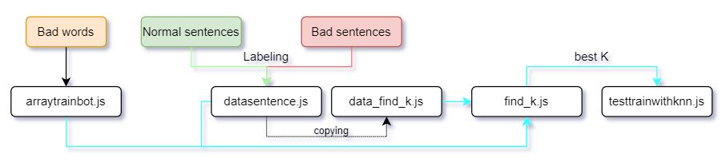

# Introduction

Welcome to simple classification project usin KNN algorithm | K - Nearest Neighbor algorithm
- Fristly, let thank for contributing the "Bad words" data of many highschool students at Danang city.
- Secondly, I hope you will have the funny time in this project. I had tried editing and customizing my code in the easiest way, which can help you understand KNN algorithm and how to implement it on a project.

In summary, it also contained Auto Find the best K algorithm for KNN. A powerful tool that can save your time. The best K is K:
- The closest neighbor can affect the test accuracy on all your data the lowest
- It is NOT 1 - because you need to be objective
- It is NOT even number - because you use the voting in KNN, the label of the new point is what the label has more quantity, so if you have 2 blue and 2 red, the system will be confusing.
- A second largest number

# A few notes about classification_Vietnamese_sentence_knn_simple project

- > It's example just fun. But you can use it in spam or impolite classification.
- > You should run find_k.js to get best k before run testtrainwithknn.js.
- > All is javascript and I don't use any library to build it.
- > I hope it can help you fun and learn KNN to easy.
- > Try it, Good luck !!!!

# The flow

If you want to try with your data or do not understand how it work, please see it in this picture, you can see its flow.



## You need preparing data first (bad words list, types of sentences) and find out the best K. Finnal, use the best K has been found for testing. The main flow is the blue lines.


# Data classified sentences ready for KNN
| Sentence | Label |
|--------------|-------|
| Thứ phò cẩu | Câu bị nghi vấn |
|Con cẩu sanh|Câu bị nghi vấn|
|Bươm bướm dối trá không thấy ngượng mồm|Câu bị nghi vấn|
|Nhớ gia đình ạ|Câu bình thường|
|Bản thân của ngày xưa|Câu bình thường|
|Gặt hái được nhiều thành công|Câu bình thường|
|May mắn lắm đó nha|Câu bình thường|
|Tui nói ông nghe nè, tui yêu ông|Câu bình thường|
|Thương em là điều anh không thể ngờ|Câu bình thường|
|em muốn uống trà sữa|Câu bình thường|
|xịt sữa|Câu bị nghi vấn|
|bình thường, cx ko hay chi mấy|Câu bình thường|
|Thay ava chào năm mới cho đỡ mốc|Câu bình thường|
|..See more at datasentence.js...|...See more at datasentence.js..|

# Bad words
|Word|
|----|
|cc|
|đồ chó|
|clon|
|đm|
|địt con mẹ|
|địt mẹ|
|chu cái mỏ lồn|
|súc vật|
|Đạp mày nát bét|
|Đéo|
|Đè bẹp mày|
|Khinh tao à|
|...See more at arraytrainbot.js...|

# List K test - get it in file find_k.js
|K|Correct prediction|
|---|----|
|1|74|
|2|69|
|3|74|
|4|72|
|5|74|
|6|71|
|7|71|
|8|71|
|9|71|
|10|71|

```diff
That is result for find_k.js : best K : 5 . It isn't good but not bad. That was an objective result in 10 test rounds
The accuracy is 
- 74% for 2237 bad words* @@ 
*: (word + sentence contain bad words) and 85 classified sentences 
```
